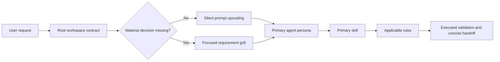

# Universal AI Engineering Dotfolder

A portable software-engineering control plane for a computer science student
using Cursor, Claude Code, and Google Antigravity. One policy body, one set of
agent personas, and one skill library serve all three hosts, backed by
deterministic local validation.

> **This branch is a scaffold.** The payload was cleared so the skill and command
> library can be rebuilt from scratch. What remains is the structure, the format
> contract, one worked example threaded through every registry, and copy-ready
> authoring templates. The previous full set of personas, skills, commands,
> workflows, and rules is still on `main`.

The design assumes prompts may be short. Safe ambiguity is silently expanded
into a professional execution contract; decision-changing ambiguity triggers a
focused requirement grill. Every implementation remains subject to memory,
resource, complexity, architecture, security, testing, and evidence checks.

## Architecture

```text
universal-ai-dotfolder/
├── .gitignore                local Python and test artifact exclusions
├── AGENTS.md                 canonical workspace policy and routing registry
├── CLAUDE.md                 Claude Code import bridge
├── agents/                   flat portable persona definitions
│   ├── _TEMPLATE.md          authoring template
│   └── example-engineer.md   worked example
├── commands/                 Cursor and Claude Code slash commands
│   ├── _TEMPLATE.md
│   └── example.md
├── workflows/                Antigravity slash trajectories
│   ├── _TEMPLATE.md
│   └── example.md
├── rules/                    Cursor rule files
│   ├── _TEMPLATE.mdc
│   └── 01-example-guard.mdc
├── skills/                   on-demand skill packages
│   ├── _template/            authoring template package
│   └── example-skill/
│       ├── SKILL.md          routing description and operating contract
│       ├── agents/
│       │   └── openai.yaml   concise discovery metadata
│       ├── references/       deep guidance only where the skill requires it
│       └── example_utility.py  present only for executable utility skills
├── scripts/
│   └── validate_workspace.py deterministic registry and structure validator
└── tests/
    └── test_validate_workspace.py validator regression tests
```

Each skill is self-contained and loaded only after routing selects it. The
always-loaded context therefore stays compact even as the toolkit grows to cover
a wide engineering surface.

Files and directories whose name begins with an underscore are authoring
templates. They are copy sources, never routed to, and skipped by the validator.



## Native Placement

This repository is the canonical payload. Review destination conflicts before
copying host-native artifacts.

| Host | Project placement |
|---|---|
| Cursor | `agents/*.md` → `.cursor/agents/`; `commands/` → `.cursor/commands/`; `rules/` → `.cursor/rules/`; `skills/` → `.cursor/skills/` |
| Claude Code | `agents/*.md` → `.claude/agents/`; `commands/` → `.claude/commands/`; `skills/` → `.claude/skills/` |
| Antigravity | `agents/*.md` → `.agents/agents/`; `workflows/` → `.agents/workflows/`; `skills/` → `.agents/skills/` |

Exclude the underscore-prefixed templates when copying, so no host registers a
`/_TEMPLATE` route or offers a template package for selection.

Keep `AGENTS.md` at the project root. Cursor and Antigravity read it as
workspace context. Claude Code reads `CLAUDE.md`, which imports `AGENTS.md`, so
all three hosts share one policy body.

Rules are expressed as Cursor `.mdc` files because Cursor discovers that format
natively. Their essential safety, architecture, ambiguity, and evidence
requirements are also present in `AGENTS.md`, so Claude Code and Antigravity do
not lose the core guardrails.

For machine-wide reuse, install reviewed agent profiles in
`~/.cursor/agents/`, `~/.claude/agents/`, or `~/.gemini/config/agents/`.
Project-local placement is safer when a profile or skill contains
repository-specific behavior.

## How Each Platform Interacts

### Cursor

1. Root `AGENTS.md` establishes the workspace contract and portable aliases.
2. `.cursor/rules/*.mdc` attaches the short global rules and only the language or
   domain rules whose globs or descriptions match the active work.
3. `.cursor/commands/*.md` exposes the slash routes.
4. `.cursor/agents/*.md` enables native specialist delegation from profile
   descriptions; `/example-engineer` explicitly selects that persona.
5. `.cursor/skills/*/SKILL.md` supplies the selected task method without loading
   the entire library.

`@agents/example-engineer.md` attaches the canonical file as context. Native
agent selection and a file attachment are distinct operations.

### Claude Code

1. Root `CLAUDE.md` imports `AGENTS.md`.
2. `.claude/commands/*.md` exposes the same slash routes as Cursor.
3. `.claude/agents/*.md` enables automatic delegation by description,
   `@agent-example-engineer` for a specific task, and
   `claude --agent example-engineer` for a session.
4. `.claude/skills/*/SKILL.md` provides the routed workflow and any bounded
   utility or reference it names.

Plain `@agents/example-engineer.md` imports file context; it does not create a
native isolated subagent.

### Google Antigravity

1. Root `AGENTS.md` supplies workspace policy and alias resolution.
2. `.agents/agents/*.md` exposes native custom agents; `/agents` lists or
   switches them and the planner may delegate by profile description.
3. `.agents/workflows/*.md` binds each slash name to its deterministic
   trajectory.
4. `.agents/skills/*/SKILL.md` supplies the selected operating contract.

Antigravity consumes `workflows/`, while Cursor and Claude Code consume
`commands/`. Every basename is paired, so a route has the same intent across
hosts.

Without native installation, use a portable instruction such as
`Use @agents/example-engineer.md for this API change`. The root registry tells
the active model to adopt the attached profile for that task. This does not
create an isolated subagent.

Platform behavior and placement were checked against official documentation on
2026-07-29:

- [Antigravity custom agents](https://antigravity.google/docs/subagents) and
  [workspace context](https://antigravity.google/docs/cli/best-practices)
- [Cursor subagents](https://cursor.com/docs/subagents.md),
  [rules](https://cursor.com/docs/rules.md), and
  [`@` context](https://cursor.com/docs/agent/prompting.md)
- [Claude Code subagents](https://code.claude.com/docs/en/sub-agents) and
  [workspace memory](https://code.claude.com/docs/en/memory)

## Authoring

`scripts/validate_workspace.py` enforces the contract below. Copy the matching
template, fill it in, then run the validator.

| Artifact | Required frontmatter | Additional requirements |
|---|---|---|
| `agents/<name>.md` | `name`, `description`, `model` | `name` equals the filename stem; `model: inherit`; headings `Role`, `Scope`, `Guardrails`, `Workflow`, `Output Contract` |
| `skills/<name>/SKILL.md` | `name`, `description` | `name` equals the directory name; description is at least 25 characters and states activation with `Use when`, `Use for`, `Use before`, `Use after`, `Use to`, or `Use implicitly` |
| `skills/<name>/agents/openai.yaml` | none | `interface:` mapping with quoted `display_name`, `short_description` of 25 to 64 characters, and `default_prompt` containing `$<name>` |
| `commands/<name>.md` | `description`, `argument-hint` | body references `skills/<skill>/SKILL.md` |
| `workflows/<name>.md` | `name`, `description` | `name` equals the filename stem; body references `../skills/<skill>/SKILL.md` |
| `rules/NN-<name>.mdc` | `description`, `globs`, `alwaysApply` | two-digit prefixes contiguous from `01`; at least one rule sets `alwaysApply: true` |

The frontmatter key set must match exactly. Extra or missing keys are errors.

Every slash route exists twice, once in `commands/` and once in `workflows/`,
under the same basename. Both files must resolve to the same skill contract so a
route means the same thing on every host.

Text files may not contain unfinished-work markers or a literal ellipsis, and
every relative Markdown link must resolve. The exact rejected markers are listed
in `PLACEHOLDER_PATTERNS` in the validator. Skill utilities are standard library
only, take an explicit argument vector, bound their output, and must be
executable.

### Adding A Skill

1. Copy `skills/_template/` to `skills/<name>/` and set `name` in `SKILL.md` to
   the new directory name.
2. Fill in `agents/openai.yaml`, including `$<name>` in `default_prompt`.
3. Keep `references/` only for guidance too long or too optional for the
   contract; delete it otherwise.
4. Add a utility only when deterministic local computation genuinely beats
   prose, then `chmod +x` it.
5. Copy `commands/_TEMPLATE.md` and `workflows/_TEMPLATE.md` to the same
   basename and point both at the new skill.
6. Declare the skill under `### Declared Skills` in `AGENTS.md` using the exact
   `` - `name` — purpose. `` form the validator parses.
7. Run `./scripts/validate_workspace.py`.

Adding a persona is the same flow against `agents/_TEMPLATE.md`, declared under
`### Declared Profiles` as `` - `@name` → `agents/name.md` — purpose. ``

## Validation

Run the complete deterministic structural audit:

```bash
./scripts/validate_workspace.py
```

It verifies agent and skill frontmatter, unique names, root registry
declarations against the files on disk, skill UI metadata, command and workflow
parity with matching skill targets, rule ordering, local Markdown links,
forbidden unfinished markers, Python syntax, and executable bits.

Run the validator's regression tests:

```bash
python3 -m unittest -v tests.test_validate_workspace
```

Runtime requirements are Python 3.10 or newer and Git. Local code execution uses
the user's ordinary operating-system access; time and output limits reduce risk
but are not a security sandbox.
