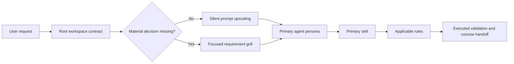

# Universal AI Engineering Dotfolder

A portable software-engineering control plane for a computer science student
using Cursor, Claude Code, and Google Antigravity. It combines 50 specialist
agent personas, 56 on-demand skills, 53 slash routes per supported command host,
20 Cursor rules (5 global and 15 conditional), and deterministic local
validation.

The design assumes prompts may be short. Safe ambiguity is silently expanded
into a professional execution contract; decision-changing ambiguity triggers a
focused requirement grill. Every implementation remains subject to memory,
resource, complexity, architecture, security, testing, and evidence checks.

## Architecture

```text
universal-ai-dotfolder/
├── .gitignore                local Python and test artifact exclusions
├── AGENTS.md                 canonical workspace policy and routing registry
├── CLAUDE.md                 Claude Code import bridge
├── agents/                   50 flat portable persona definitions
├── commands/                 53 Cursor and Claude Code slash commands
├── workflows/                53 Antigravity slash trajectories
├── rules/                    20 Cursor rule files
├── skills/                   56 on-demand skill packages
│   └── skill-name/
│       ├── SKILL.md          routing description and operating contract
│       ├── agents/
│       │   └── openai.yaml   concise discovery metadata
│       ├── references/       deep guidance only where the skill requires it
│       └── utility.py        present only for executable utility skills
├── scripts/
│   └── validate_workspace.py deterministic registry and structure validator
└── tests/
    └── test_validate_workspace.py validator regression tests
```

Each skill is self-contained and loaded only after routing selects it. The
always-loaded context therefore stays compact even though the toolkit covers a
wide engineering surface.



## Native Placement

This repository is the canonical payload. Review destination conflicts before
copying host-native artifacts.

| Host | Project placement |
|---|---|
| Cursor | `agents/*.md` → `.cursor/agents/`; `commands/` → `.cursor/commands/`; `rules/` → `.cursor/rules/`; `skills/` → `.cursor/skills/` |
| Claude Code | `agents/*.md` → `.claude/agents/`; `commands/` → `.claude/commands/`; `skills/` → `.claude/skills/` |
| Antigravity | `agents/*.md` → `.agents/agents/`; `workflows/` → `.agents/workflows/`; `skills/` → `.agents/skills/` |

Keep `AGENTS.md` at the project root. Cursor and Antigravity read it as
workspace context. Claude Code reads `CLAUDE.md`, which imports `AGENTS.md`, so
all three hosts share one policy body.

Rules are expressed as Cursor `.mdc` files because Cursor discovers that format
natively. Their essential safety, architecture, ambiguity, and evidence
requirements are also present in `AGENTS.md`, so Claude Code and Antigravity do
not lose the core guardrails.

For machine-wide reuse, install reviewed agent profiles in
`~/.cursor/agents/`, `~/.claude/agents/`, or `~/.gemini/config/agents/`.
Project-local placement is safer when a profile or skill contains
repository-specific behavior.

## How Each Platform Interacts

### Cursor

1. Root `AGENTS.md` establishes the workspace contract and portable aliases.
2. `.cursor/rules/*.mdc` attaches the five short global rules and only the
   language or domain rules whose globs or descriptions match the active work.
3. `.cursor/commands/*.md` exposes the slash routes.
4. `.cursor/agents/*.md` enables native specialist delegation from profile
   descriptions; `/backend-engineer` explicitly selects that persona.
5. `.cursor/skills/*/SKILL.md` supplies the selected task method without loading
   the entire library.

`@agents/backend-engineer.md` attaches the canonical file as context. Native
agent selection and a file attachment are distinct operations.

### Claude Code

1. Root `CLAUDE.md` imports `AGENTS.md`.
2. `.claude/commands/*.md` exposes the same slash routes as Cursor.
3. `.claude/agents/*.md` enables automatic delegation by description,
   `@agent-backend-engineer` for a specific task, and
   `claude --agent backend-engineer` for a session.
4. `.claude/skills/*/SKILL.md` provides the routed workflow and any bounded
   utility or reference it names.

Plain `@agents/backend-engineer.md` imports file context; it does not create a
native isolated subagent.

### Google Antigravity

1. Root `AGENTS.md` supplies workspace policy and alias resolution.
2. `.agents/agents/*.md` exposes native custom agents; `/agents` lists or
   switches them and the planner may delegate by profile description.
3. `.agents/workflows/*.md` binds each slash name to its deterministic
   trajectory.
4. `.agents/skills/*/SKILL.md` supplies the selected operating contract.

Antigravity consumes `workflows/`, while Cursor and Claude Code consume
`commands/`. Every basename is paired, so `/profile`, `/frontend`, or `/audit`
has the same intent across hosts.

Without native installation, use a portable instruction such as
`Use @agents/backend-engineer.md for this API change`. The root registry tells
the active model to adopt the attached profile for that task. This does not
create an isolated subagent.

Platform behavior and placement were checked against official documentation on
2026-07-29:

- [Antigravity custom agents](https://antigravity.google/docs/subagents) and
  [workspace context](https://antigravity.google/docs/cli/best-practices)
- [Cursor subagents](https://cursor.com/docs/subagents.md),
  [rules](https://cursor.com/docs/rules.md), and
  [`@` context](https://cursor.com/docs/agent/prompting.md)
- [Claude Code subagents](https://code.claude.com/docs/en/sub-agents) and
  [workspace memory](https://code.claude.com/docs/en/memory)

## Agent Persona Registry

Profiles are flat for cross-host portability. Every file has a unique
lowercase-hyphenated name, a routing-focused description, `model: inherit`, and
Role, Scope, Guardrails, Workflow, and Output Contract sections.

### Leadership and Architecture

`principal-software-architect`, `solutions-architect`,
`staff-software-engineer`, `technical-lead`, `engineering-manager`,
`generalist-software-engineer`

### Product, Experience, and Applications

`product-manager`, `user-experience-designer`, `application-engineer`,
`frontend-engineer`, `backend-engineer`, `full-stack-engineer`,
`mobile-engineer`, `desktop-engineer`, `game-engineer`,
`accessibility-engineer`

### Systems and Domain Engineering

`systems-programming-engineer`, `embedded-firmware-engineer`,
`kernel-engineer`, `compiler-toolchain-engineer`,
`distributed-systems-engineer`, `networking-protocol-engineer`,
`database-storage-engineer`, `graphics-realtime-engineer`,
`robotics-controls-engineer`, `digital-hardware-engineer`,
`scientific-computing-engineer`, `reverse-engineering-engineer`

### Algorithms, Data, AI, and Education

`algorithm-engineer`, `formal-methods-engineer`, `data-engineer`,
`machine-learning-engineer`, `mlops-engineer`, `ai-systems-engineer`,
`research-engineer`, `computer-science-educator`

### Assurance, Delivery, and Operations

`debugging-investigator`, `code-reviewer`, `test-reliability-engineer`,
`security-engineer`, `performance-engineer`,
`contract-compatibility-engineer`, `repository-maintainer`,
`build-release-engineer`, `platform-devops-engineer`,
`cloud-infrastructure-engineer`, `site-reliability-engineer`,
`developer-experience-engineer`, `documentation-engineer`,
`technical-interviewer`

Route by dominant responsibility, not language. `AGENTS.md` selects one primary
profile and at most two supporting profiles when ownership boundaries genuinely
cross.

## Skill Toolkit

### Intent, Planning, and Learning

`requirement-griller`, `prompt-upscaler`, `task-planner`,
`assumption-auditor`, `learning-tutor`, `interview-coach`, `rubber-duck`,
`code-explainer`

### Architecture and Interface Design

`architecture-decision`, `architecture-mapper`, `change-impact-analyzer`,
`frontend-design`, `api-designer`, `database-designer`,
`distributed-systems-design`, `systems-programming`, `algorithm-designer`,
`cli-designer`, `configuration-designer`, `error-handling`,
`observability-design`

### Review, Correctness, and Security

`code-griller`, `code-review`, `edge-case-hunter`, `complexity-coach`,
`invariant-miner`, `concurrency-review`, `security-threat-model`,
`accessibility-auditor`, `privacy-review`

### Test Engineering

`test-strategy`, `test-generator`, `property-test-designer`,
`fuzzing-strategy`, `coverage-analyzer`, `mutation-tester`

### Diagnostics and Performance

`debugging-playbook`, `execution-tracer`, `reproducer-builder`,
`regression-bisector`, `sanitizer-runner`, `mem-leak-auditor`,
`performance-profiler`, `benchmark-harness`

### Change, Delivery, and Repository Work

`project-bootstrapper`, `refactoring-guide`, `dependency-upgrader`,
`migration-planner`, `ci-pipeline-builder`, `release-readiness`,
`incident-postmortem`, `documentation-writer`, `adr-writer`, `git-manager`,
`shell-exec`, `repo-search`

The `requirement-griller` asks one to five decision-linked questions only after
read-only inspection proves the answer is not locally discoverable. The
`prompt-upscaler` has two modes: implicit use silently drives execution, while
explicit `/upscale` returns only Context, Constraints, Objective, and Exact
Output.

The `frontend-design` skill inspects the existing product language before
choosing one coherent visual thesis. It rejects generic gradient, glass,
card-grid, pill-everything, empty oversized hero, emoji-icon, and decorative
reveal defaults. Its gates cover semantic markup, keyboard operation, visible
focus, WCAG AA contrast, reduced motion, UI states, touch targets, content
stress, narrow phones, tablets, desktop widths, and short laptop heights.

Eight skills include executable standard-library utilities:

| Skill | Utility | Purpose |
|---|---|---|
| `prompt-upscaler` | `upscale.py` | Deterministic four-part prompt structuring |
| `code-griller` | `grill.py` | Bounded severity-ranked static review |
| `shell-exec` | `exec.py` | Direct-argument process execution with timeout and output caps |
| `git-manager` | `git_sync.py` | Concise state, explicit staging, history, and SSH diagnostics |
| `repo-search` | `search.py` | Ranked bounded repository search |
| `mem-leak-auditor` | `audit_memory.py` | Strict C compilation and bounded Valgrind parsing |
| `test-generator` | `build_tests.py` | Non-overwriting Python or C regression harness generation |
| `architecture-mapper` | `map_repo.py` | Deterministic Mermaid dependency and inferred-call mapping |

## Slash Route Catalog

Commands and workflows share basenames. The route reads its mapped `SKILL.md`,
preserves trailing arguments as task input, inspects relevant context, and
applies that skill's output and mutation contract.

### Intent and Learning

`/upscale`, `/grill-me`, `/plan`, `/assumptions`, `/explain`, `/learn`,
`/interview`, `/rubber-duck`

### Design and Architecture

`/design`, `/impact`, `/frontend`, `/api`, `/database`, `/systems`, `/race`,
`/distributed`, `/algorithm`, `/cli`, `/config`, `/errors`, `/observability`,
`/map`

### Review and Risk

`/grill`, `/review`, `/audit`, `/edge-cases`, `/complexity`, `/invariants`,
`/threat-model`, `/a11y`, `/privacy`

### Testing

`/test`, `/test-strategy`, `/property-test`, `/fuzz`, `/coverage`, `/mutate`

### Diagnostics and Performance

`/debug`, `/trace`, `/repro`, `/bisect`, `/sanitize`, `/profile`, `/bench`

### Change and Delivery

`/bootstrap`, `/refactor`, `/dependencies`, `/migrate`, `/ci`, `/release`,
`/postmortem`, `/docs`, `/adr`

Read-only review routes never modify code unless the user separately requests a
fix. Mutating routes remain bounded by the user's original scope and approval
requirements.

## Rule Set

Five concise rules are always on:

- `01-architecture-guard.mdc`
- `02-requirements-upscale.mdc`
- `03-student-learning.mdc`
- `04-evidence-before-claims.mdc`
- `17-change-hygiene.mdc`

The remaining rules attach by file match or model decision:

- language and runtime: `05-c-cpp-safety.mdc`,
  `06-rust-unsafe-boundaries.mdc`, `07-python-correctness.mdc`,
  `08-concurrency-discipline.mdc`, `09-network-io.mdc`;
- data and contracts: `10-storage-migrations.mdc`,
  `16-contract-evolution.mdc`;
- security and quality: `11-security-privacy.mdc`, `12-test-quality.mdc`,
  `13-frontend-quality.mdc`, `14-benchmark-rigor.mdc`,
  `18-documentation-evidence.mdc`, `19-ai-tool-boundaries.mdc`;
- delivery and provenance: `15-build-reproducibility.mdc`,
  `20-dependency-supply-chain.mdc`.

## Validation

Run the complete deterministic structural audit:

```bash
./scripts/validate_workspace.py
```

It verifies agent and skill frontmatter, unique names, root declarations, skill
UI metadata, command/workflow parity and skill targets, rule ordering, local
Markdown links, forbidden unfinished markers, Python syntax, and executable
bits.

Run the validator's regression tests:

```bash
python3 -m unittest -v tests/test_validate_workspace.py
```

Validate skill packages against the official skill-authoring contract:

```bash
for skill in skills/*; do
  python3 /home/rahulb/.codex/skills/.system/skill-creator/scripts/quick_validate.py "$skill"
done
```

Runtime requirements are Python 3.10 or newer, Git for `git-manager`, and a C
compiler plus Valgrind for live memory audits. Local code execution uses the
user's ordinary operating-system access; time and output limits reduce risk but
are not a security sandbox.
